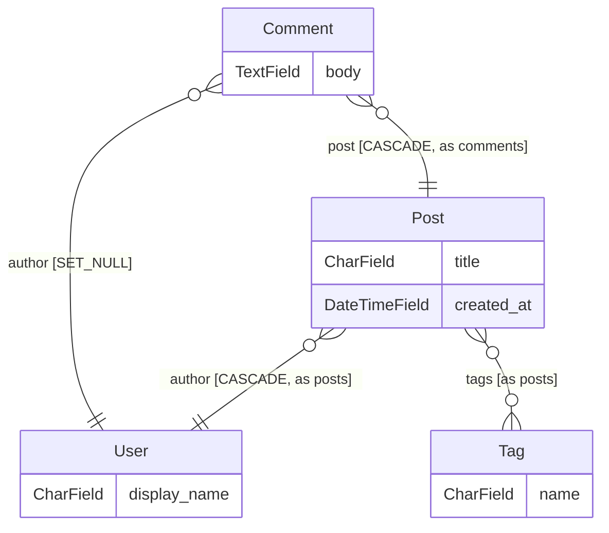

**English** · [Русский](https://github.com/FROWNINGdev/django-orm-lens/blob/main/docs/i18n/README.ru.md) · [Español](https://github.com/FROWNINGdev/django-orm-lens/blob/main/docs/i18n/README.es.md) · [中文](https://github.com/FROWNINGdev/django-orm-lens/blob/main/docs/i18n/README.zh.md)

<div align="center" markdown="1">


<br/>
<br/>

# Django ORM Lens

### The schema intelligence layer for Django.

Your entire model graph — live in your editor sidebar, gating your CI, and answering your AI agent over MCP. All from static parsing: no database, no `runserver`, no working venv.

**Replaces:** `graph_models` + `django-schema-graph` + hand-drawn ER diagrams + grep archaeology.

<br/>

<!-- Hero — LIVE badges only, minimal (FastAPI / Rich pattern) -->

[](https://pypi.org/project/django-orm-lens/)
[](https://pypi.org/project/django-orm-lens/)
[](https://pypi.org/project/django-orm-lens/)
[](https://github.com/FROWNINGdev/django-orm-lens/actions/workflows/ci.yml)
[](https://pepy.tech/project/django-orm-lens)
[](LICENSE)

<br/>

<!-- One-click install per platform -->

[](https://marketplace.visualstudio.com/items?itemName=frowningdev.django-orm-lens)
[](https://open-vsx.org/extension/frowningdev/django-orm-lens)
[](https://github.com/FROWNINGdev/django-orm-lens/pkgs/container/django-orm-lens)

<br/>

<sub>Featured in <a href="https://django-news.com/archive/issue-347-django-61-release-candidate-1-released/">Django News #347</a> · <a href="https://pycoders.com/issues/746">PyCoder's Weekly #746</a></sub>

</div>

---

## ⚡ 10 seconds to first insight

```bash
uvx django-orm-lens scan      # or: pipx run django-orm-lens scan
```

Cold clone, broken venv, no settings module — you still get every app, model, field, and relation of the project in your terminal.

**Then pick your surface** — three distributions, one parser core:

| You are | Install | You get |
|---|---|---|
| **Editor user** — VS Code / Cursor / Windsurf / VSCodium | `code --install-extension frowningdev.django-orm-lens` | Field autocomplete in `.filter()`, sidebar tree, live ER diagram, hover cards, 17 QuickFix rules |
| **Terminal / CI user** | `pip install django-orm-lens` | 17 subcommands, SARIF + PR annotations, pre-commit hooks, a GitHub Action |
| **AI-agent user** — Cursor / Claude Code / Aider / Zed / Continue | `pip install "django-orm-lens[mcp]"` | 13 read-only MCP tools answering schema questions from ground truth |

MCP setup is one JSON block — see [Integrations](#-integrations). Point `DJANGO_ORM_LENS_ROOT` at your Django project's absolute path.

---

## 🆓 Paid-tier capabilities, free and MIT

Schema review is a paid category nearly everywhere. A bot that reviews every pull request, analysis that follows a queryset past the function it was built in, a check that catches schema drift, index advice grounded in real table statistics — those normally sit behind a per-seat or per-database subscription.

All of it is here, MIT-licensed, with no tier gate, no seat count, no account, and no telemetry:

| Capability usually sold as a paid tier | Here |
|---|---|
| PR review bot for schema changes — posts once, then updates in place | [`blast-radius`](docs/rules/blast-radius.md) + the [Action](#️-gate-your-ci) |
| Analysis that follows a queryset across functions | [`nplusone`](docs/rules/nplusone.md) |
| Schema drift detection | [`drift`](docs/rules/drift.md) |
| Index proposals from observed QuerySet usage | `suggest-indexes` |
| Migration risk weighed against real table sizes | `blast-radius --stats` |
| Blast radius of a destructive migration | [`blast-radius`](docs/rules/blast-radius.md) |
| Cross-layer impact of removing a field | `impact` |

**There is no Pro tier, and none is planned.** If the tool saves you an afternoon, a star is the entire ask.

---

## 📊 Traction

<div align="center" markdown="1">

<!-- Traction — LIVE counters only, no hardcoded numbers.

     The two VS Code counters deliberately do not come from shields.io. Its
     whole `visual-studio-marketplace/*` family is retired and now answers
     every request with a grey "retired badge" — which is exactly what the
     rating badge on this page had silently become, reporting nothing while
     looking like it reported something. vsmarketplacebadges.dev reads the
     same Marketplace gallery API and is live, so those two keep counting.

     Open VSX is listed separately from the Marketplace rather than folded
     into one "editor installs" number: they are different registries with
     different audiences (VSCodium, Gitpod, Eclipse Theia), and the download
     counts differ by an order of magnitude, so summing them would hide the
     more interesting of the two. -->

[](https://github.com/FROWNINGdev/django-orm-lens/stargazers)
[](https://github.com/FROWNINGdev/django-orm-lens/network/members)
[](https://github.com/FROWNINGdev/django-orm-lens/graphs/contributors)
[](https://pypi.org/project/django-orm-lens/)
[](https://pepy.tech/project/django-orm-lens)
[](https://open-vsx.org/extension/frowningdev/django-orm-lens)
[](https://marketplace.visualstudio.com/items?itemName=frowningdev.django-orm-lens)
[](https://marketplace.visualstudio.com/items?itemName=frowningdev.django-orm-lens&ssr=false#review-details)
[](https://github.com/FROWNINGdev/django-orm-lens/commits/main)

<br/>

<!-- Directory presence — one row per registry, no duplicates -->

[](https://registry.modelcontextprotocol.io/)
[](https://smithery.ai/server/@frowningdev/django-orm-lens)
[](https://glama.ai/mcp/servers/FROWNINGdev/django-orm-lens)
[](https://github.com/punkpeye/awesome-mcp-servers)
[](https://mcp.so/servers/django-orm-lens)

</div>

> If the tool saves you a `grep` next time you touch a strange Django project — **[a star helps others find it](https://github.com/FROWNINGdev/django-orm-lens/stargazers)**.

### 📈 Star growth

<div align="center">
  <a href="https://www.star-history.com/?repos=FROWNINGdev%2Fdjango-orm-lens&type=date&legend=top-left">
    <picture>
      <source media="(prefers-color-scheme: dark)" srcset="https://api.star-history.com/chart?repos=FROWNINGdev/django-orm-lens&type=date&theme=dark&legend=top-left&sealed_token=Bt09MbOICQzMe0Yzud5Up9GEQwXZReJEx6n5AS5Sl2GB3UtfipcUjyojd3g8PEfAkOFiZgy5uJel_LoNeLy_r7I4pyGhnYdUyQIbJDQzKlx1oA3BLRkxlAgby995WLgF7Ze1fdg2TlS6EJH0aRozsCZnwP1rtqXbMCWRMu1c9qpFrPcKxgFNd1G9fWMT" />
      <source media="(prefers-color-scheme: light)" srcset="https://api.star-history.com/chart?repos=FROWNINGdev/django-orm-lens&type=date&legend=top-left&sealed_token=Bt09MbOICQzMe0Yzud5Up9GEQwXZReJEx6n5AS5Sl2GB3UtfipcUjyojd3g8PEfAkOFiZgy5uJel_LoNeLy_r7I4pyGhnYdUyQIbJDQzKlx1oA3BLRkxlAgby995WLgF7Ze1fdg2TlS6EJH0aRozsCZnwP1rtqXbMCWRMu1c9qpFrPcKxgFNd1G9fWMT" />
      
    </picture>
  </a>
</div>

---

## ⚡ Install

**VS Code / Cursor / Windsurf** (VS Code Marketplace):

```bash
code --install-extension frowningdev.django-orm-lens
```

**VSCodium / code-server / Gitpod / any OSS Code fork** (Open VSX):

```bash
codium --install-extension frowningdev.django-orm-lens
```

Or search **`Django ORM Lens`** in the Extensions view — same publisher `frowningdev` on both registries.

**Terminal & AI coding agents:**

```bash
pip install django-orm-lens              # CLI only
pip install "django-orm-lens[mcp]"       # + MCP server for AI agents
```

Requires Python 3.9+. Zero runtime dependencies for the CLI.

**Docker (v0.6+):**

```bash
docker run --rm -v "$PWD:/workspace" ghcr.io/frowningdev/django-orm-lens scan --path .
```

Multi-arch (amd64 + arm64). No Python required on the host. Good for CI and one-off audits.

<br/>

## 🎯 The problem

> **Works offline. Works on a broken venv. Works on someone else's laptop. Works in CI.**

You open a Django project. It has 20 apps. You need to answer a simple question:

> _"Which app owns the `Order` model, and how is it connected to `User`?"_

Today, that means: `Ctrl+P`, "models", scroll through 30 hits, open five files, `Ctrl+F` for `class Order`, read through 400 lines of `ForeignKey('otherapp.Something')` strings, try to remember what you learned two files ago.

**Half a day gone. Every time. On every project.**

<br/>

## ✨ With Django ORM Lens

<table>
<tr>
<td width="50%" valign="top">

### 📚 A tree of everything

Every app → every model → every field → every `Meta` option. Grouped by application, sorted alphabetically, expandable.

Icons distinguish `CharField` from `ForeignKey` from `ManyToManyField` at a glance.

</td>
<td width="50%" valign="top">

### 🕸️ A live ER diagram

One command opens a Mermaid entity-relationship diagram of your entire schema. Watch it redraw as you edit. Export to SVG.

`ForeignKey`, `OneToOneField`, and `ManyToManyField` become proper cardinality arrows.

</td>
</tr>
<tr>
<td width="50%" valign="top">

### 🔎 Hover for relations

Hover over `ForeignKey('app.Model')` in any Python file → a card pops up with the target model's fields, relations, and a "Jump to" link. No `Ctrl+F`, no file dialog.

</td>
<td width="50%" valign="top">

### 🧭 Jump-to-definition

Click any field in the tree → cursor lands on the exact line. Filter the tree by app or model name. Split `models/` packages are fully supported.

</td>
</tr>
<tr>
<td width="50%" valign="top">

### ⚡ Zero configuration

No `DJANGO_SETTINGS_MODULE`. No `runserver`. Parses `models.py` statically. Works with a broken venv, a missing dependency, or on someone else's laptop.

</td>
<td width="50%" valign="top">

### 🎨 Native VS Code UI

Dark theme. Light theme. Your theme. Follows your icon theme, your font, your key bindings. Nothing garish, nothing branded.

</td>
</tr>
</table>

<br/>

## 🚀 Power features

<table>
<tr>
<td width="50%" valign="top">

### 💥 Blast radius

The review-time question a schema change actually raises: **what does this hit?** Every destructive migration operation becomes a target carrying its risks, every place in the codebase that still reads it, and — for whole-model operations — the cascade fallout.

`migration-risk`, `impact` and `cascade` each answer a third of that; nobody joins them by hand, so the tool does. `--format markdown` is a postable PR comment; `--stats` turns "probably populated" into `~41 000 000 rows, 12.0 GB` from a read-only query you run yourself, with no database credential anywhere near CI.

</td>
<td width="50%" valign="top">

### 🧭 Schema drift

`makemigrations --check` without booting Django. Each app's migrations are replayed in order into the field set they imply, then compared against what `models.py` declares.

Django's own check needs a working settings module, an importable app registry and every dependency installed — unavailable on a cold clone or a broken venv, which is exactly when the answer is cheapest to act on. Only the dangerous direction fails the build: a field declared but never migrated means the column will not exist, and the first query touching it errors.

</td>
</tr>
<tr>
<td width="50%" valign="top">

### 🎯 Inline diagnostics & QuickFixes (18 rules)

Static analysis over `.py` files with Ruff-style codes (`DOL001`..`DOL041`), Clippy-style `Applicability`, and per-rule severity overrides. `.count() > 0` → `.exists()`, `null=True` on `CharField`, missing `on_delete`, `datetime.now()` → `timezone.now()`, planner-GUC overrides in raw SQL (`enable_*`, `plan_cache_mode`, `jit*`; diagnostic-only), and a dozen more.

Suppress inline with `# django-orm-lens-disable-next-line DOL007`.

</td>
<td width="50%" valign="top">

### 🧪 Factory generator

Right-click any model → `factory_boy` `DjangoModelFactory` scaffold with Faker providers keyed by field type. `CharField(max_length)` scales word-count buckets, `DecimalField(N,D)` computes `left_digits=N-D`, `choices=` maps to `Iterator`, M2M gets `@post_generation`. FK chains pull related factories transitively.

Also available as CodeLens above each model class.

</td>
</tr>
<tr>
<td width="50%" valign="top">

### 🕰 Time-Travel Schema Diff

Pick a `models.py`, pick two commits, get a typed diff as PR-ready markdown. `AddModel` / `DropModel` / `RenameModel` / `ModifyModel` events with confidence-scored rename detection (Levenshtein + field-shape Jaccard).

Renames are first-class events, never `Add + Drop`. Blob-SHA LRU cache — commits that don't touch `models.py` share their parsed snapshot.

</td>
<td width="50%" valign="top">

### 🔎 Impact analysis

"What breaks if I remove this field?" — right-click a field or model → workspace-wide scan grouped by Django layer (models, serializers, forms, admin, views, urls, templates, tests, migrations).

Findings carry a **Certain / Likely / Possibly** confidence tag. Handles ORM string refs (`order_by("-author")`), kwarg lookups (`filter(author__id=1)`), `Meta.fields` tuples, and template variables.

</td>
</tr>
<tr>
<td width="50%" valign="top">

### ⚡ Interactive query builder

Right-click a field or model → pick a template → snippet inserted at cursor (with tab-stops) or in a fresh untitled buffer.

`.filter(field=?)` on an FK auto-appends `.select_related(...)`, `.annotate(post_count=Count('post_set'))` honours `related_name`, `.prefetch_related` for M2M, `.values('field').distinct()`, `.only('field')`.

</td>
<td width="50%" valign="top">

### 🎨 Sidebar UX overhaul

Stable `TreeItem.id` — refresh no longer collapses the tree. Rich `MarkdownString` tooltips with `command:` deep-links. Activity-bar badge counts DOL### issues.

`FileDecorationProvider` badges: red `!` on FK-without-`on_delete`, yellow `~` on `null=True` string fields (bubbles up to the parent Model row, Git-style).

</td>
</tr>
</table>

<br/>

## 📸 What it looks like

<div align="center" markdown="1">

</div>

**Live sample** — real `django-orm-lens er` output, rendered by GitHub right here:



**Also included in the extension:**

- 🕸️ **Live ER diagram** — Mermaid cardinality arrows, edge labels (`CASCADE`, `through Model`, `as related_name`), theme-aware, one-click SVG export
- 🔎 **Hover cards** — over any `ForeignKey('app.Model')` or `ManyToManyField(...)`, with a one-click jump link
- 🧭 **CodeLens** — above every `class Model` line: field count, relation count, and an **Open ER diagram** action
- 🎨 **Named themes** — `auto` / `default` / `dark` / `forest` / `neutral` for the diagram webview

<br/>

## 🤖 For terminals and AI coding agents

The same parser that powers the VS Code extension ships as a standalone Python package — with an optional **MCP (Model Context Protocol) server** so any MCP-compatible AI agent can navigate your Django schema without importing Django or booting your app.

### CLI

```bash
django-orm-lens scan -f json                 # every app, every model, every field
django-orm-lens describe blog.Post           # one model in Markdown
django-orm-lens list | fzf                   # flat app.Model — pipes anywhere
django-orm-lens er > schema.mmd              # ER diagram — Mermaid (default)
django-orm-lens er -f dbml > schema.dbml     # …or DBML: paste into dbdiagram.io
django-orm-lens er -f d2 > schema.d2         # …or D2 / plantuml / dot
django-orm-lens diff before.json after.json  # what a PR changes structurally
django-orm-lens nplusone --format github     # N+1 findings as PR annotations
django-orm-lens migration-risk -f sarif      # SARIF for GitHub Code Scanning
django-orm-lens suggest-indexes blog.Post    # Meta.indexes proposals from usage
django-orm-lens signals                      # sender→signal→handler graph
django-orm-lens migration-deps blog -f mermaid   # per-app migration DAG
django-orm-lens cascade blog.Author          # what one delete() takes down
django-orm-lens impact author                # what still references a field
django-orm-lens blast-radius -f markdown     # risks + who still reads them
django-orm-lens drift                        # migrations vs models, no boot
django-orm-lens stats-sql                    # read-only SQL for --stats
```

> `impact`, `blast-radius`, `drift` and `stats-sql` ship in **py-1.7.0** and later.

Every command accepts `--path <dir>` and `--exclude <glob>`. `nplusone` / `migration-risk` / `diff` exit code `1` on findings — drop them into CI to block PRs on regressions.

### MCP server

Register it once with your agent and it exposes thirteen read-only tools:

| Tool | Purpose |
| --- | --- |
| `list_apps` | Every Django app in the workspace with model counts |
| `list_models` | Flat `app.Model` list, optional app filter |
| `describe_model` | Full field / relation / Meta detail for one model |
| `find_relations` | Inbound + outbound relations for one model |
| `cascade_preview` | Blast radius of one `delete()`, grouped by `on_delete` |
| `er_diagram` | ER diagram — `mermaid` / `dbml` / `d2` / `plantuml` / `dot` |
| `describe_migration_dependency` | Per-app migration DAG: roots, leaves, cross-app deps |
| `suggest_indexes` | `Meta.indexes` proposals from observed QuerySet usage |
| `signal_graph` | Sender→signal→handler graph from `@receiver` decorators |
| `blast_radius` | What a destructive migration hits: its risks, the code still reading it, the cascade fallout |
| `drift` | `makemigrations --check` without booting Django — migrations diffed against `models.py` |
| `impact` | Every reference to a field or model name, grouped by Django layer |
| `nplusone_scan` | Static N+1 findings for the whole workspace |

```bash
# Start it directly
django-orm-lens-mcp

# Or via the CLI subcommand
django-orm-lens mcp
```

**Workspace resolution (py-1.3.0+).** Every tool accepts an optional
`workspace_root` argument on the call. Resolution priority: explicit arg →
`$DJANGO_ORM_LENS_ROOT` → current working directory. Invalid or non-Django
paths return a structured envelope
(`{"error": "WORKSPACE_NOT_DJANGO", "hint": "…"}`) instead of empty results,
so the agent can self-correct. Optional sandbox via
`DJANGO_ORM_LENS_ALLOWED_ROOTS` (`;`-separated on Windows, `:` elsewhere).

<br/>

## 🛡️ Gate your CI

Schema regressions are cheapest to catch the moment they enter a PR. Four zero-config ways to block them:

**Blast-radius PR bot** — the whole schema review as one comment, updated in place on every push instead of a new comment each time:

```yaml
name: Schema review
on: pull_request

permissions:
  contents: read
  pull-requests: write        # only for `comment: true`

jobs:
  blast-radius:
    runs-on: ubuntu-latest
    steps:
      - uses: actions/checkout@v4
      - uses: FROWNINGdev/django-orm-lens@action-v1
        with:
          command: blast-radius
          only-changed: true          # scope to migrations this PR touches
          comment: true               # post once, then update in place
          github-token: ${{ github.token }}
```

The comment goes up **before** the job fails, so a blocked PR still explains why. `only-changed` reads the PR's file list from the API rather than `git diff`, because `actions/checkout` defaults to `fetch-depth: 1` and the base commit is not in the local history. On `push` events both flags skip with a notice instead of failing, so one workflow covers both triggers.

> The Action installs from PyPI, so `blast-radius` and `drift` need **py-1.7.0** or later — pin it with `version: 1.7.0` if your workflow must not drift. To run an unreleased build instead, add `install: false` and install the source yourself; [this repo's own workflow](.github/workflows/schema-review.yml) does exactly that, and is what verifies the Action on every PR.


**pre-commit** — two hooks, nothing to install locally:

```yaml
# .pre-commit-config.yaml
repos:
  - repo: https://github.com/FROWNINGdev/django-orm-lens
    rev: py-v1.8.1
    hooks:
      - id: django-orm-lens-nplusone
      - id: django-orm-lens-migration-risk
```

**GitHub Action** — findings appear as PR annotations with zero extra permissions:

```yaml
- uses: FROWNINGdev/django-orm-lens@action-v1
  with:
    command: migration-risk      # or: nplusone
    format: github               # ::error / ::warning annotations on the diff
```

**SARIF → Code Scanning** — findings land in the repo Security tab:

```yaml
- run: |
    pip install django-orm-lens
    django-orm-lens migration-risk --format sarif --exit-zero > lens.sarif
- uses: github/codeql-action/upload-sarif@v3
  with:
    sarif_file: lens.sarif
```

Exit codes are CI-native: `diff` and `nplusone` exit `1` on findings, `migration-risk` and `blast-radius` exit `1` on critical findings, `drift` exits `1` when a field is declared but never migrated. Add `--exit-zero` for report-only mode.

<br/>

## 🔌 Integrations

| Client | How to enable | Status |
|---|---|:-:|
| **VS Code** | `code --install-extension frowningdev.django-orm-lens` | ✅ |
| **Cursor** | same VSIX + optional MCP entry in `~/.cursor/mcp.json` | ✅ |
| **Windsurf / VSCodium / any Code fork** | install the VSIX from the [Marketplace](https://marketplace.visualstudio.com/items?itemName=frowningdev.django-orm-lens) or [GitHub Releases](https://github.com/FROWNINGdev/django-orm-lens/releases) | ✅ |
| **Aider** | add `django-orm-lens-mcp` to your `mcp.json` | ✅ (via MCP) |
| **Continue.dev** | register the MCP server in `~/.continue/config.json` | ✅ (via MCP) |
| **Zed** | register the MCP server in Zed settings | ✅ (via MCP) |
| **Any MCP-compatible client** | point `command` at `django-orm-lens-mcp`, set `DJANGO_ORM_LENS_ROOT` | ✅ |
| **pre-commit** | `repo: https://github.com/FROWNINGdev/django-orm-lens` + two hook ids | ✅ |
| **GitHub Actions** | `uses: FROWNINGdev/django-orm-lens@action-v1` — annotations or SARIF | ✅ |
| **Discoverable via [MCP Registry](https://registry.modelcontextprotocol.io/)** | official Model Context Protocol server directory | ✅ |
| **Plain terminal / CI** | `pip install django-orm-lens && django-orm-lens scan` | ✅ |

### Example: Cursor / any MCP client

```jsonc
{
  "mcpServers": {
    "django-orm-lens": {
      "command": "django-orm-lens-mcp",
      "env": { "DJANGO_ORM_LENS_ROOT": "/abs/path/to/your/project" }
    }
  }
}
```

<br/>

## ⚡ Performance

The regression suite parses the vendored model graphs of **Zulip, Saleor, Wagtail, django CMS, and Mezzanine** — 59 models across 13,478 lines of real-world `models.py` — in about **20 ms** end-to-end on a laptop (21 ms best-of-3 on the repo's golden-fixture corpus; a `<2 s` guard runs in CI on every matrix cell).

Reproduce it yourself:

```bash
git clone https://github.com/FROWNINGdev/django-orm-lens && cd django-orm-lens/cli
pip install -e . && python -m pytest tests/test_golden_fixtures.py tests/test_golden_snapshots.py -q
```

<br/>

## 🎯 Who this is for

- **Django developers** joining a codebase with 10+ apps and getting lost in `models.py` sprawl.
- **Contract / freelance engineers** who need to grasp an unfamiliar Django project in the first hour, not the first week.
- **Teams onboarding new hires** who want a one-glance schema view without spinning up documentation infrastructure.
- **AI-agent power users** (Cursor / Aider / Zed / Continue / any MCP-compatible client) who need the agent to answer schema questions accurately — without giving it database credentials or booting Django.
- **CI pipelines** that verify schema shape (e.g. "did we accidentally break a `related_name`?") without importing the project.
- **Solo indie devs** on a broken venv or someone else's laptop — no `runserver`, no `manage.py migrate`, still works.

<br/>

## 🗺️ Market position

Django ORM Lens sits at the intersection of **editor tooling** and **AI-agent tooling** — a slot no existing package covers:

| Segment | Existing option | What it costs you |
|---|---|---|
| Boot-and-graph | `django-extensions graph_models` | Requires Graphviz + Django settings + a working DB URL |
| Web-based viewer | `django-schema-graph` | Requires a running Django server; hosts one more thing to break |
| Admin panel | Django Admin | Requires runserver + auth + database — great for data, not for architecture |
| Editor plugin | PyCharm's Django Structure | Locked to PyCharm; no CLI, no AI-agent story |
| MCP server | (none until now) | AI agents guess your schema from source, imperfectly |

**Django ORM Lens is the only tool that ships three surfaces from one parser:** a VS Code extension (any Code fork), a zero-dep CLI (terminals + CI), and an MCP server (AI agents). All static. All free. All MIT.

<br/>

## 🤔 How is this different?

| | **Django ORM Lens** | `django-extensions graph_models` | `django-schema-graph` | Django Admin | PyCharm Django Structure |
|---|:-:|:-:|:-:|:-:|:-:|
| Works without a bootable Django project | ✅ | ❌ | ❌ | ❌ | ⚠️ |
| Zero-install (no graphviz, no server) | ✅ | ❌ | ❌ | ❌ | ❌ (needs PyCharm) |
| Works in VS Code / Cursor / any Code fork | ✅ | ❌ | ❌ | ❌ | ❌ |
| Sidebar tree inside the editor | ✅ | ❌ | ❌ | ❌ | ✅ |
| Live ER diagram | ✅ | ✅ | ✅ | ❌ | ❌ |
| Hover cards on `ForeignKey` | ✅ | ❌ | ❌ | ❌ | ⚠️ |
| CodeLens on model classes | ✅ | ❌ | ❌ | ❌ | ❌ |
| Split `models/` package support | ✅ | ⚠️ | ⚠️ | ✅ | ✅ |
| CLI for terminal / CI | ✅ | ⚠️ | ❌ | ❌ | ❌ |
| MCP server for AI agents | ✅ | ❌ | ❌ | ❌ | ❌ |
| Discoverable in the [MCP Registry](https://registry.modelcontextprotocol.io/) | ✅ | ❌ | ❌ | ❌ | ❌ |
| Free & open-source (MIT) | ✅ | ✅ | ✅ | ✅ | ❌ (paid IDE) |
| Django version support | **4.0 – 5.2** | latest | 3.2 – 4.1 (stale since 2023) | latest | latest |

> *`django-schema-graph` has not been updated since 2023-05 and does not test Django 5.x.*

### When you want something else

Honest boundaries: profiling a live request → **django-debug-toolbar**. Historical request profiling → **django-silk**. Query-count assertions inside a test suite → **django-perf-rec**. Production APM on real traffic → **Scout / Sentry**. Django ORM Lens deliberately stays static — it's the layer that works before the app can even boot, and the only one your CI and your AI agent can use on any checkout.

<br/>

## ⚙️ Configuration

The defaults are opinionated and sensible. If you need to tweak:

```jsonc
// .vscode/settings.json
{
  "djangoOrmLens.excludeGlobs": [
    "**/migrations/**",
    "**/node_modules/**",
    "**/venv/**",
    "**/.venv/**",
    "**/env/**"
  ],
  "djangoOrmLens.autoRefresh": true
}
```

| Setting | Type | Default | What it does |
|---|---|---|---|
| `djangoOrmLens.excludeGlobs` | `string[]` | See above | Glob patterns to skip when scanning |
| `djangoOrmLens.autoRefresh` | `boolean` | `true` | Rescan on `models.py` changes |
| `djangoOrmLens.codeFixes.enabled` | `boolean` | `true` | Master switch for the DOL### diagnostics + QuickFixes |
| `djangoOrmLens.rules` | `object` | `{}` | Per-rule severity: `{ "DOL007": "off", "DOL013": "error" }` |
| `djangoOrmLens.rulesSelect` | `string[]` | `[]` | Ruff-style select. `["DOL0"]` runs only queryset+model rules |
| `djangoOrmLens.rulesIgnore` | `string[]` | `[]` | Ruff-style ignore. `["DOL03"]` silences form/view rules |

<br/>

## 🔬 Rule catalogue

Eighteen editor-side checks (`DOL001`–`DOL041`) with Ruff-style codes, per-rule severity, and Clippy-style applicability — plus fifteen CLI-side migration-risk rules and the static N+1 analyzer. **Every rule now has its own documentation page.**

| Category | Rules | Examples |
|---|---|---|
| [Queryset](https://github.com/FROWNINGdev/django-orm-lens/blob/main/docs/rules/README.md) | `DOL001`–`DOL007` | `.count() > 0` → `.exists()`, FK access in loops (N+1) |
| [Model definition](https://github.com/FROWNINGdev/django-orm-lens/blob/main/docs/rules/README.md) | `DOL011`–`DOL015` | `ForeignKey` without `on_delete`, `null=True` on string fields |
| [Datetime](https://github.com/FROWNINGdev/django-orm-lens/blob/main/docs/rules/README.md) | `DOL021`–`DOL022` | `datetime.now()` → `timezone.now()` |
| [Forms / views](https://github.com/FROWNINGdev/django-orm-lens/blob/main/docs/rules/README.md) | `DOL031`–`DOL032` | `locals()` in `render()`, `Meta.fields = '__all__'` |
| [Raw SQL](https://github.com/FROWNINGdev/django-orm-lens/blob/main/docs/rules/DOL041.md) | `DOL041` | `SET enable_hashjoin = off`, `plan_cache_mode`, `jit` overrides in app code |
| [Migration risks](https://github.com/FROWNINGdev/django-orm-lens/blob/main/docs/rules/migrations.md) | 16 rules | NOT NULL add without default, table-locking index builds, irreversible data migrations |
| [Static N+1](https://github.com/FROWNINGdev/django-orm-lens/blob/main/docs/rules/nplusone.md) | 1 analyzer | FK/M2M access in loops without `select_related` / `prefetch_related` |

→ **[Full rule reference](https://github.com/FROWNINGdev/django-orm-lens/blob/main/docs/rules/README.md)** — every code with bad/good examples, QuickFix behaviour, and suppression syntax.

### Suppress inline

```python
# django-orm-lens-disable-next-line DOL007
for user in User.objects.all():
    print(user.profile)  # not flagged

qs.count() > 0  # django-orm-lens-disable-line DOL001

# django-orm-lens-disable DOL011  ← on its own line, kills DOL011 for the rest of the file
```

Applicability follows Rust's Clippy: **safe** fixes can be applied automatically ("Fix All"), **suggestion** fixes are offered as a QuickFix but reviewed, **unsafe** findings never auto-apply. Fixes are separated from analyzers (Roslyn-style), so one rule can grow multiple fixers over time without touching detection logic.

<br/>

## 🧭 Commands

Open the command palette (`Ctrl+Shift+P` / `Cmd+Shift+P`) and type "Django ORM Lens":

| Command | What it does |
|---|---|
| `Django ORM Lens: Refresh` | Force-rescan the workspace |
| `Django ORM Lens: Show ER Diagram` | Open the Mermaid ER diagram side-by-side |
| `Django ORM Lens: Filter Models` | Filter the tree by app / model / field name |
| `Django ORM Lens: Clear Filter` | Restore the full tree |
| `Django ORM Lens: Jump to Model` | Programmatic — triggered by tree clicks and hover cards |
| `Django ORM Lens: Find Reverse References` | Right-click a model — QuickPick of every FK pointing at it |
| `Django ORM Lens: Generate factory_boy Factory` | Right-click a model or use CodeLens — scaffold a `DjangoModelFactory` |
| `Django ORM Lens: Schema Diff (Time-Travel)` | Pick two commits — get a typed diff as a markdown buffer |
| `Django ORM Lens: Find Impact (What Uses This?)` | Right-click a field or model — workspace-wide reference scan |
| `Django ORM Lens: Build Query (Insert Snippet)` | Right-click a field or model — pick an ORM template |

<br/>

## 🗺️ Roadmap

**Shipped**

- [x] Sidebar tree grouped by app
- [x] Live Mermaid ER diagram
- [x] Hover cards over `ForeignKey('app.Model')`
- [x] Filter tree by name
- [x] Split `models/` package support
- [x] Export ER diagram as SVG
- [x] Python CLI + MCP server for terminals and AI agents
- [x] Welcome view for empty workspaces
- [x] Path-safe jump-to-definition and sanitized hover markdown
- [x] **v0.3.0** — CodeLens above each model class (`N fields · N relations · Open ER diagram`)
- [x] **v0.3.0** — Edge labels on the diagram (`CASCADE`, `SET_NULL`, `PROTECT`, `related_name`)
- [x] **v0.3.0** — Named color themes (`auto` / `default` / `dark` / `forest` / `neutral`)
- [x] **v0.3.1** — `through_model` on M2M edges (contributed by [@kingrubic](https://github.com/kingrubic))
- [x] **v0.3.1** — Listed in the [official MCP Registry](https://registry.modelcontextprotocol.io/) + [Glama.ai](https://glama.ai/mcp/servers/FROWNINGdev/django-orm-lens)
- [x] **v0.6.0** — CLI `nplusone` — static N+1 detector (FK/M2M access inside loops without `select_related`/`prefetch_related`)
- [x] **v0.6.0** — CLI `migration-risk` — flags risky operations in `migrations/*.py` (15 rules today)
- [x] **v0.6.0** — CLI `diff` — compare two schema JSON dumps for PR review
- [x] **v0.6.0** — ER-diagram minimap color-codes nodes by Django app
- [x] **v0.6.0** — README translations: 🇷🇺 Russian, 🇪🇸 Spanish, 🇨🇳 Chinese
- [x] **v0.6.0** — Docker image on GHCR: `docker run ghcr.io/frowningdev/django-orm-lens`
- [x] **v0.7.0** — `settings.AUTH_USER_MODEL` resolves everywhere: n+1 reverse-relations, signal senders, Mermaid ER, VS Code webview, inbound-relation panel, React ER
- [x] **v0.7.0** — AST-based field parser: `ForeignKey(on_delete=CASCADE, to='User')` resolves regardless of kwarg order (Python + TS parity)
- [x] **v0.7.0** — Public shared helpers: `find_user_model`, `resolve_related_tail`, `find_model`, `iter_workspace_py_files` (Python) + `findUserModel`, `resolveRelatedTail` (TS)
- [x] **v0.7.0** — `--verbose` no longer walks the tree twice; `WorkspaceIndex.scanned_files` carries the count
- [x] **v0.7.3** — PEP-526 type annotations on fields (`jti: CharField[str] = models.CharField(...)`) now parse — reported by [@jsabater](https://github.com/jsabater) ([#25](https://github.com/FROWNINGdev/django-orm-lens/issues/25)) with a clean Django Ninja 1.6 repro
- [x] **v0.7.4** — PEP-695 generic class headers (Python 3.12+): `class Container[T](models.Model):` now parses
- [x] **v0.7.5** — Aliased models module (`from django.db import models as m`) and third-party field packages (`jsonfield.JSONField`) now detected
- [x] **v0.7.6** — Tab-indented model bodies now parse (editors defaulting to tabs no longer show empty models)
- [x] **v0.8.0** — Inline QuickFixes: 16 rules (`DOL001`..`DOL032`) with per-rule severity + Ruff-style select/ignore + inline `# django-orm-lens-disable-next-line`
- [x] **v0.8.0** — Factory generator: `factory_boy` scaffold from any model with Faker providers keyed by field type
- [x] **v0.8.0** — Time-Travel Schema Diff: pick two commits → typed markdown diff with first-class rename detection
- [x] **v0.8.0** — Impact analysis: workspace-wide field-reference scan across every Django layer with Certain/Likely/Possibly confidence tags
- [x] **v0.8.0** — Interactive Query Builder: right-click → template → snippet inserted at cursor, grammar-aware (FK gets `.select_related`, `related_name` honoured)
- [x] **v0.8.0** — Sidebar UX overhaul: stable `TreeItem.id`, `MarkdownString` tooltips with `command:` deep-links, `FileDecorationProvider` badges, `TreeView.badge` on the activity bar, three when-gated `viewsWelcome` states

**v1.5.0** — the "one core, three surfaces" wave

- [x] CI formats: SARIF 2.1.0 + `--format github` PR annotations for `nplusone` and `migration-risk`
- [x] Four analyzers promoted from MCP-only to the CLI: `suggest-indexes`, `signals`, `migration-deps`, `cascade`
- [x] `er --format dbml | d2 | plantuml | dot` — community-standard diagram exports (dbdiagram.io, D2, PlantUML, Graphviz — `dot` contributed by [@JJordan0C](https://github.com/JJordan0C))
- [x] Three new migration-risk rules: `runpython_no_reverse`, `alter_unique_together_lock`, `alter_index_together_deprecated` — 15 total
- [x] pre-commit hooks (`django-orm-lens-nplusone`, `django-orm-lens-migration-risk`) + composite GitHub Action
- [x] `docs/rules/` — a documentation page for every rule (19 pages)
- [x] Golden-snapshot regression suite over 59 real-world models (Zulip / Saleor / Wagtail / django CMS / Mezzanine); ruff + mypy now gate CI
- [x] Migration dependency graph — `migration-deps` (text / json / mermaid)

**py-1.7 → 1.8** — the schema-intelligence wave

- [x] `blast-radius` — migration risks joined with what still reads the schema they touch, as a PR bot (`comment: true`, sticky, `only-changed`)
- [x] `drift` — `makemigrations --check` without booting Django
- [x] `impact <name>` — what still references a model or field, grouped by Django layer
- [x] `blast-radius --stats` + `stats-sql` — optional production row counts from read-only SQL you run yourself (the tool never holds a DB credential)
- [x] `nplusone` resolves across functions — a queryset returned by a helper is followed into the loop that consumes it
- [x] `blast_radius`, `drift` and `impact` exposed as MCP tools — thirteen tools for AI agents
- [x] `drift` documents its `!!` / `~` marks in the report and in `--help` — reported by [@sevdog](https://github.com/sevdog) ([#57](https://github.com/FROWNINGdev/django-orm-lens/issues/57))
- [x] `drift` follows inheritance from abstract bases — an abstract base's fields count as the concrete child's own, as Django treats them — reported by [@sevdog](https://github.com/sevdog) ([#58](https://github.com/FROWNINGdev/django-orm-lens/issues/58))
- [x] `suggest-index` recognises the indexes Django already made — primary key (`pk` and `id` are one lookup), `db_index`, `unique`, foreign keys, `unique_together`, `UniqueConstraint` — reported by [@sevdog](https://github.com/sevdog) ([#60](https://github.com/FROWNINGdev/django-orm-lens/issues/60)), same cause independently found by [@RinZ27](https://github.com/RinZ27) ([#61](https://github.com/FROWNINGdev/django-orm-lens/pull/61))
- [x] A sixth golden fixture — Read the Docs joins Zulip, Saleor, Wagtail, django-CMS and Mezzanine, putting the parser under 75 models and 538 fields of real-world Django — contributed by [@JJordan0C](https://github.com/JJordan0C) ([#62](https://github.com/FROWNINGdev/django-orm-lens/pull/62), closing [#51](https://github.com/FROWNINGdev/django-orm-lens/issues/51))
- [x] django-taggit `TaggableManager` is read as the M2M it is — through `taggit.TaggedItem` to `taggit.Tag`, `through=` overrides honoured, in both the Python and the TypeScript parser — contributed by [@Guflly](https://github.com/Guflly) ([#63](https://github.com/FROWNINGdev/django-orm-lens/pull/63), closing [#50](https://github.com/FROWNINGdev/django-orm-lens/issues/50))
- [x] `DOL021` states the `USE_TZ` default correctly — `False` through Django 4.2, `True` from 5.0, with the `startproject` template's `USE_TZ = True` since 4.0 called out as the separate thing it is — and no longer claims `timezone.now()` is always aware UTC — found by [@Justine0211](https://github.com/Justine0211) while translating the page ([#52](https://github.com/FROWNINGdev/django-orm-lens/issues/52))
- [x] The `parity_input.py` fixture carries the `models` import a real `models.py` would have — contributed by [@RinZ27](https://github.com/RinZ27) ([#64](https://github.com/FROWNINGdev/django-orm-lens/pull/64))

**py-1.9 → 1.12** — the real-checkout wave

Found by running the CLI over actual checkouts of django-oscar, django-guardian, django-allauth and django-cms rather than over fixtures. Every one of these was invisible to a green test suite, and two of them made the tool answer confidently with something false.

- [x] Models declared inside a module-level block parse — the swappable-model idiom (`if not is_model_registered(...):` and then an indented `class`) that every pluggable Django framework uses, against class discovery anchored on `^class`. django-oscar went from 12 models, every one of them from its own `tests/` directory, to 82. All six golden snapshots stayed byte-identical: a column-0 class parses exactly as before
- [x] `abstract_models.py` is read alongside `models.py` — pluggable frameworks keep the abstract base there and leave `models.py` holding only the concrete subclass, so 72 of django-oscar's 83 models reported zero fields between them. Now 8, and those 8 are correct: they subclass *concrete* models, where multi-table inheritance leaves the columns on the parent's table
- [x] `drift` no longer fails a build over two app directories sharing a name — replayed migration state is merged per app name, matching how the declared side is already keyed. On a real django-guardian checkout the blocking count goes 1 → 0 and the contradictory duplicate row disappears, while a genuinely unmigrated field still blocks
- [x] django-mptt models are no longer invisible — `MPTTModel` is a recognised base, and `TreeForeignKey` / `TreeOneToOneField` / `TreeManyToManyField` are reported as the Django fields they subclass, so `TreeForeignKey('self', ...)` draws exactly the self-edge a plain `ForeignKey('self', ...)` does. No `django-mptt` dependency is added — the parser keeps working against a broken venv. Saleor's `product.Category` and its `children` edge now appear in the golden snapshot: 76 added lines, none removed (closing [#49](https://github.com/FROWNINGdev/django-orm-lens/issues/49))
- [x] The MCP server reports its own version — `FastMCP` forwards none, so the SDK fell back to `importlib.metadata.version("mcp")` and every `initialize` response named the wrong project's release number to the client

**v0.9 → v0.12.1** — the extension catches up

- [x] **v0.9.0** — Partial `UniqueConstraint` tracking in Time-Travel Schema Diff: `add` / `drop` / `change` / `rename` as typed events, with `fromCondition` carrying the pre-change predicate so a review comment can show `Q(is_primary=True) → Q(is_primary=True, deleted=False)`, and a rename no longer showing up as a lossy `add + drop` pair. Multiple unnamed constraints on one model key onto `#anon-<index>` instead of collapsing into a single event. Prompted by django-extensions [#1813](https://github.com/django-extensions/django-extensions/issues/1813), where `sqldiff` drops the `condition=` predicate so migration reviewers never see what changed
- [x] **v0.10.0** — Impact-analysis layer detection runs on the workspace-relative path. It used to match `/tests/` and `/views.py` anywhere in a file's *absolute* path, so a project checked out under any directory called `tests` — or a monorepo with `services/tests/` above it — had every file reported as that layer, `views.py` as a test, `admin.py` as a test. Also: webview messages validated by origin rather than by source, and conflicting leaf migrations detected — two migrations claiming the same parent, which Django only complains about at `migrate` time
- [x] **v0.10.1** — The Marketplace listing names impact analysis, blast radius and schema drift, and says plainly that the tool is free and MIT with no Pro tier. The store page had still described the extension as a sidebar and an ER diagram — what it was two waves earlier — so nobody searching for those features found it. Metadata takes effect only on publish, which is why it needed a release of its own
- [x] **v0.11.0** — The TypeScript half of django-mptt support, cut as its own release rather than folded into a later one: between py-1.12.0 shipping and this build, the CLI and the extension disagreed about what a django-mptt schema contains, which is the exact failure the shared golden fixture exists to prevent
- [x] **v0.12.0** — The extension asks for a GitHub star, on the third *user-initiated* ER-diagram open. Not on install: a prompt arriving before the tool has done anything gets dismissed reflexively, and that dismissal is permanent in the user's mind. Sidebar refreshes that re-render an already-open panel are not counted — they are not the user asking for anything. "Later" and "Don't ask again" are stored as separate states, so a deferral re-arms the ask exactly once, twelve opens later; two prompts is the lifetime maximum. The policy is a pure function covered by six tests that need no VS Code host
- [x] **v0.12.1** — Export as SVG wrote an unopenable file. `toSvg` returns percent-encoded markup where `toPng` returns base64; the save path assumed base64 for anything starting with `data:`, and base64-decoding percent-encoded text does not fail — the decoder silently drops every character outside its alphabet and returns bytes. A 48-character `<svg>` document reached disk with the right name, a plausible size and no valid content anywhere in it. The transfer encoding is now read from the data-URL header instead of guessed from the prefix

**Next**

- [ ] ORM query autocomplete inside `.filter()` / `.exclude()` / `.annotate()` ([#3](https://github.com/FROWNINGdev/django-orm-lens/issues/3))
- [ ] App / model toggle checkboxes to declutter huge schemas
- [ ] DOL rule engine ported into the Python CLI — one rule catalogue, three surfaces

**Later**

- [ ] Third-party field support — `django-model-utils` (`django-taggit` shipped in py-1.11.0, `django-mptt` in py-1.12.0 / v0.11.0)
- [ ] JetBrains / PyCharm plugin (if there is demand)

Vote by 👍-ing the corresponding [issue](https://github.com/FROWNINGdev/django-orm-lens/issues).

<br/>

## ❓ FAQ

<details>
<summary><b>Do you send any of my code to a server?</b></summary>
<br/>
No. Every byte stays on your machine. The parser is pure TypeScript (extension) or pure Python (CLI). No LLM calls, no telemetry, no analytics, no error reporting. The Mermaid renderer runs inside VS Code's webview sandbox.
</details>

<details>
<summary><b>Does it work with Poetry / uv / conda / no venv at all?</b></summary>
<br/>
Yes. The extension reads Python source directly — it does not import Django and does not care what package manager you use. The CLI requires Python 3.9+, but that is it.
</details>

<details>
<summary><b>My models are split across multiple files inside a <code>models/</code> package. Does that work?</b></summary>
<br/>
Yes, since v0.2.0. Both the extension and the CLI walk <code>models/*.py</code> alongside classic <code>models.py</code>.
</details>

<details>
<summary><b>Can I use it with DRF serializers, Wagtail, Oscar, or third-party base models?</b></summary>
<br/>
Any class that looks like a Django model is picked up: subclasses of <code>models.Model</code>, abstract bases starting with <code>Abstract</code>, common mixins ending in <code>Mixin</code>, and known base names like <code>TimeStampedModel</code> or <code>PolymorphicModel</code>. Non-model classes (<code>ModelAdmin</code>, <code>ModelSerializer</code>, <code>Form</code>, <code>View</code>, <code>Manager</code>, …) are filtered out.
</details>

<details>
<summary><b>Which AI agents can use the MCP server?</b></summary>
<br/>
Any MCP-compatible client — Cursor, Aider, Continue.dev, Zed, and any other tool that speaks the protocol. Just point <code>command</code> at the installed <code>django-orm-lens-mcp</code> binary. See the <a href="#-integrations">Integrations</a> section.
</details>

<details>
<summary><b>How do I block schema regressions in CI?</b></summary>
<br/>
Three ways, all zero-config: the two <a href="#%EF%B8%8F-gate-your-ci">pre-commit hooks</a>, the composite GitHub Action (<code>uses: FROWNINGdev/django-orm-lens@action-v1</code> with <code>format: github</code> for PR annotations), or <code>--format sarif</code> piped into <code>github/codeql-action/upload-sarif</code> for the Security tab. <code>diff</code> / <code>nplusone</code> exit 1 on findings, <code>migration-risk</code> exits 1 on critical findings.
</details>

<details>
<summary><b>Is there a JetBrains / PyCharm version?</b></summary>
<br/>
Not yet. PyCharm's Django Structure tool window is already good, so the value delta is smaller. If enough people ask, it becomes worth doing.
</details>

<br/>

## 🆘 Support

- 🐛 **Bug reports** — [GitHub Issues](https://github.com/FROWNINGdev/django-orm-lens/issues) (please include a minimal `models.py` snippet)
- 💡 **Feature requests / ideas** — [GitHub Discussions](https://github.com/FROWNINGdev/django-orm-lens/discussions)
- 📝 **Marketplace reviews** — [rate the extension](https://marketplace.visualstudio.com/items?itemName=frowningdev.django-orm-lens&ssr=false#review-details) (the fastest signal that keeps this project moving)
- 🐍 **PyPI page** — [pypi.org/project/django-orm-lens](https://pypi.org/project/django-orm-lens/)
- 💚 **Sponsor** — [github.com/sponsors/FROWNINGdev](https://github.com/sponsors/FROWNINGdev)

<br/>

## 📜 License

MIT © [FROWNINGdev](https://github.com/FROWNINGdev)

<br/>

<div align="center" markdown="1">

**Made for developers who care about their codebase.**

[Marketplace](https://marketplace.visualstudio.com/items?itemName=frowningdev.django-orm-lens) · [PyPI](https://pypi.org/project/django-orm-lens/) · [GitHub](https://github.com/FROWNINGdev/django-orm-lens) · [Issues](https://github.com/FROWNINGdev/django-orm-lens/issues) · [Discussions](https://github.com/FROWNINGdev/django-orm-lens/discussions) · [Sponsor](https://github.com/sponsors/FROWNINGdev)

</div>
