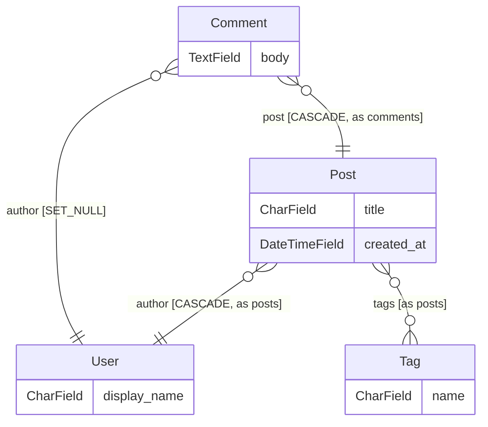

[English](../../README.md) · [Русский](README.ru.md) · [Español](README.es.md) · **中文**

<div align="center" markdown="1">


<br/>
<br/>

# Django ORM Lens

### Django 的数据结构智能层。

你的整张模型图 —— 实时呈现在编辑器侧边栏、为你的 CI 把关，并通过 MCP 回答你的 AI agent 的提问。全部来自静态解析：无需数据库、无需 `runserver`、无需可用的 venv。

**取代：** `graph_models` + `django-schema-graph` + 手绘 ER 图 + grep 考古。

<br/>

<!-- Hero — LIVE badges only, minimal (FastAPI / Rich pattern) -->

[](https://pypi.org/project/django-orm-lens/)
[](https://pypi.org/project/django-orm-lens/)
[](https://pypi.org/project/django-orm-lens/)
[](https://github.com/FROWNINGdev/django-orm-lens/actions/workflows/ci.yml)
[](https://pepy.tech/project/django-orm-lens)
[](../../LICENSE)

<br/>

<!-- One-click install per platform -->

[](https://marketplace.visualstudio.com/items?itemName=frowningdev.django-orm-lens)
[](https://open-vsx.org/extension/frowningdev/django-orm-lens)
[](https://github.com/FROWNINGdev/django-orm-lens/pkgs/container/django-orm-lens)

<br/>

<sub>收录于 <a href="https://django-news.com/archive/issue-347-django-61-release-candidate-1-released/">Django News #347</a> · <a href="https://pycoders.com/issues/746">PyCoder's Weekly #746</a></sub>

</div>

---

## ⚡ 10 秒获得第一份洞察

```bash
uvx django-orm-lens scan      # or: pipx run django-orm-lens scan
```

冷克隆、坏掉的 venv、没有 settings 模块 —— 项目的每个 app、模型、字段和关系依然会出现在你的终端里。

**接着选择你的使用面** —— 三种发行形式，同一个解析器内核：

| 你是谁 | 安装 | 你将得到 |
|---|---|---|
| **编辑器用户** —— VS Code / Cursor / Windsurf / VSCodium | `code --install-extension frowningdev.django-orm-lens` | 侧边栏树形视图、实时 ER 图、悬停卡片、16 条 QuickFix 规则 |
| **终端 / CI 用户** | `pip install django-orm-lens` | 13 个子命令、SARIF + PR 注解、pre-commit 钩子、一个 GitHub Action |
| **AI agent 用户** —— Cursor / Claude Code / Aider / Zed / Continue | `pip install "django-orm-lens[mcp]"` | 10 个只读 MCP 工具，基于确凿事实回答数据结构问题 |

MCP 配置只需一段 JSON —— 参见 [Integrations](#-integrations)。将 `DJANGO_ORM_LENS_ROOT` 指向你的 Django 项目的绝对路径。


---

## 🆓 别处收费的能力，这里免费且遵循 MIT 协议

模式审查几乎在哪里都是付费品类。逐个审查拉取请求的机器人、能把 queryset 追踪到其构建函数之外的分析、发现模式与迁移不一致的检查、基于真实表统计给出的索引建议 —— 这些通常都在按席位或按数据库计费的订阅背后。

这里全都有，采用 MIT 协议：没有分级、不数席位、无需账号、不含遥测。

| 通常需要付费的能力 | 这里 |
|---|---|
| 模式变更的 PR 审查机器人 —— 只发一条，之后原地更新 | [`blast-radius`](../rules/blast-radius.md) + Action |
| 跨函数追踪 queryset 的分析 | [`nplusone`](../rules/nplusone.md) |
| 模式漂移检测 | [`drift`](../rules/drift.md) |
| 依据实际 QuerySet 用法提出索引建议 | `suggest-indexes` |
| 结合真实表体量衡量迁移风险 | `blast-radius --stats` |
| 破坏性迁移的影响范围 | [`blast-radius`](../rules/blast-radius.md) |
| 删除字段会波及什么 —— 按 Django 分层 | `impact` |

**没有 Pro 版本，也没有相关计划。** 如果它替你省下一个下午，点个 star 就是全部的请求。


---

## 📊 项目动态

<div align="center" markdown="1">

<!-- Traction — LIVE counters only, no hardcoded numbers -->

[](https://github.com/FROWNINGdev/django-orm-lens/stargazers)
[](https://github.com/FROWNINGdev/django-orm-lens/network/members)
[](https://pypi.org/project/django-orm-lens/)
[](https://pepy.tech/project/django-orm-lens)
[](https://marketplace.visualstudio.com/items?itemName=frowningdev.django-orm-lens&ssr=false#review-details)
[](https://github.com/FROWNINGdev/django-orm-lens/graphs/contributors)
[](https://github.com/FROWNINGdev/django-orm-lens/commits/main)

<br/>

<!-- Directory presence — one row per registry, no duplicates -->

[](https://registry.modelcontextprotocol.io/)
[](https://smithery.ai/server/@frowningdev/django-orm-lens)
[](https://glama.ai/mcp/servers/FROWNINGdev/django-orm-lens)
[](https://github.com/punkpeye/awesome-mcp-servers)
[](https://mcp.so/servers/django-orm-lens)

</div>

> 如果这个工具下次帮你在一个陌生的 Django 项目里省掉一次 `grep` —— **[一颗 star 能帮助更多人发现它](https://github.com/FROWNINGdev/django-orm-lens/stargazers)**。

### 📈 Star 增长

<div align="center">
  <a href="https://www.star-history.com/?repos=FROWNINGdev%2Fdjango-orm-lens&type=date&legend=top-left">
    <picture>
      <source media="(prefers-color-scheme: dark)" srcset="https://api.star-history.com/chart?repos=FROWNINGdev/django-orm-lens&type=date&theme=dark&legend=top-left&sealed_token=Bt09MbOICQzMe0Yzud5Up9GEQwXZReJEx6n5AS5Sl2GB3UtfipcUjyojd3g8PEfAkOFiZgy5uJel_LoNeLy_r7I4pyGhnYdUyQIbJDQzKlx1oA3BLRkxlAgby995WLgF7Ze1fdg2TlS6EJH0aRozsCZnwP1rtqXbMCWRMu1c9qpFrPcKxgFNd1G9fWMT" />
      <source media="(prefers-color-scheme: light)" srcset="https://api.star-history.com/chart?repos=FROWNINGdev/django-orm-lens&type=date&legend=top-left&sealed_token=Bt09MbOICQzMe0Yzud5Up9GEQwXZReJEx6n5AS5Sl2GB3UtfipcUjyojd3g8PEfAkOFiZgy5uJel_LoNeLy_r7I4pyGhnYdUyQIbJDQzKlx1oA3BLRkxlAgby995WLgF7Ze1fdg2TlS6EJH0aRozsCZnwP1rtqXbMCWRMu1c9qpFrPcKxgFNd1G9fWMT" />
      
    </picture>
  </a>
</div>

---

## ⚡ 安装

**VS Code / Cursor / Windsurf**（VS Code Marketplace）：

```bash
code --install-extension frowningdev.django-orm-lens
```

**VSCodium / code-server / Gitpod / 任意开源 Code 派生版**（Open VSX）：

```bash
codium --install-extension frowningdev.django-orm-lens
```

或者在扩展视图中搜索 **`Django ORM Lens`** —— 两个市场上的发布者都是同一个 `frowningdev`。

**终端与 AI 编码 agent：**

```bash
pip install django-orm-lens              # CLI only
pip install "django-orm-lens[mcp]"       # + MCP server for AI agents
```

需要 Python 3.9+。CLI 运行时零依赖。

**Docker（v0.6+）：**

```bash
docker run --rm -v "$PWD:/workspace" ghcr.io/frowningdev/django-orm-lens scan --path .
```

多架构（amd64 + arm64）。宿主机无需 Python。适合 CI 与一次性审计。

<br/>

## 🎯 待解决的问题

> **离线可用。venv 坏了也能用。在别人的电脑上也能用。在 CI 里也能用。**

你打开一个 Django 项目。它有 20 个 app。你需要回答一个简单的问题：

> _"哪个 app 拥有 `Order` 模型？它是怎么和 `User` 关联的？"_

今天，这意味着：`Ctrl+P`，输入 "models"，在 30 个匹配里滚动，打开五个文件，`Ctrl+F` 搜 `class Order`，翻过 400 行 `ForeignKey('otherapp.Something')` 字符串，努力回忆两个文件之前看到的信息。

**半天没了。每次都这样。每个项目都这样。**

<br/>

## ✨ 有了 Django ORM Lens

<table>
<tr>
<td width="50%" valign="top">

### 📚 一棵覆盖一切的树

每个 app → 每个模型 → 每个字段 → 每个 `Meta` 选项。按应用分组、按字母排序、可展开。

图标能让你一眼分辨 `CharField`、`ForeignKey` 与 `ManyToManyField`。

</td>
<td width="50%" valign="top">

### 🕸️ 实时 ER 图

一条命令即可打开整个数据结构的 Mermaid 实体关系图。编辑代码时它会随之重绘。可导出为 SVG。

`ForeignKey`、`OneToOneField` 与 `ManyToManyField` 会呈现为标准的基数箭头。

</td>
</tr>
<tr>
<td width="50%" valign="top">

### 🔎 悬停查看关系

在任意 Python 文件中悬停到 `ForeignKey('app.Model')` 上 → 弹出卡片，显示目标模型的字段、关系以及一个 "Jump to" 链接。无需 `Ctrl+F`，无需文件对话框。

</td>
<td width="50%" valign="top">

### 🧭 跳转到定义

在树中点击任意字段 → 光标精准落在对应行。可按 app 或模型名过滤树形视图。完整支持拆分的 `models/` 包。

</td>
</tr>
<tr>
<td width="50%" valign="top">

### ⚡ 零配置

无需 `DJANGO_SETTINGS_MODULE`。无需 `runserver`。静态解析 `models.py`。venv 坏了、依赖缺失，甚至在别人的笔记本上也能工作。

</td>
<td width="50%" valign="top">

### 🎨 原生 VS Code UI

深色主题、浅色主题、你自定义的主题。遵循你的图标主题、字体和快捷键。不刺眼，不带品牌噪点。

</td>
</tr>
</table>

<br/>

## 🚀 进阶功能

<table>
<tr>
<td width="50%" valign="top">

### 🎯 行内 QuickFix（16 条规则）

对 `.py` 文件做静态分析：Ruff 风格的规则码（`DOL001`..`DOL032`）、Clippy 风格的 `Applicability`，以及按规则覆盖的严重级别。`.count() > 0` → `.exists()`、`CharField` 上的 `null=True`、缺失的 `on_delete`、`datetime.now()` → `timezone.now()`，以及另外十几条。

用 `# django-orm-lens-disable-next-line DOL007` 即可行内抑制。

</td>
<td width="50%" valign="top">

### 🧪 Factory 生成器

右键任意模型 → 生成 `factory_boy` 的 `DjangoModelFactory` 脚手架，Faker provider 按字段类型匹配。`CharField(max_length)` 按长度分档调整词数，`DecimalField(N,D)` 计算 `left_digits=N-D`，`choices=` 映射为 `Iterator`，M2M 使用 `@post_generation`。FK 链会传递式地拉入相关工厂。

也可通过每个模型类上方的 CodeLens 使用。

</td>
</tr>
<tr>
<td width="50%" valign="top">

### 🕰 时间旅行 Schema Diff

选一个 `models.py`，选两个 commit，得到一份可直接用于 PR 的类型化 markdown diff。`AddModel` / `DropModel` / `RenameModel` / `ModifyModel` 事件，重命名检测带置信度评分（Levenshtein + 字段形态 Jaccard）。

重命名是一等事件，绝不会退化成 `Add + Drop`。Blob-SHA LRU 缓存 —— 未改动 `models.py` 的 commit 共享同一份解析快照。

</td>
<td width="50%" valign="top">

### 🔎 影响分析

"删掉这个字段会弄坏什么？" —— 右键字段或模型 → 全工作区扫描，按 Django 层级分组（models、serializers、forms、admin、views、urls、templates、tests、migrations）。

每条结果都带 **Certain / Likely / Possibly** 置信标签。可处理 ORM 字符串引用（`order_by("-author")`）、kwarg 查询（`filter(author__id=1)`）、`Meta.fields` 元组以及模板变量。

</td>
</tr>
<tr>
<td width="50%" valign="top">

### ⚡ 交互式查询构建器

右键字段或模型 → 选择模板 → 代码片段插入光标处（带 tab-stop），或插入一个全新的未命名缓冲区。

FK 上的 `.filter(field=?)` 自动追加 `.select_related(...)`，`.annotate(post_count=Count('post_set'))` 尊重 `related_name`，M2M 用 `.prefetch_related`，还有 `.values('field').distinct()`、`.only('field')`。

</td>
<td width="50%" valign="top">

### 🎨 侧边栏 UX 全面翻新

稳定的 `TreeItem.id` —— 刷新不再折叠树。富 `MarkdownString` 工具提示，内含 `command:` 深层链接。活动栏徽标统计 DOL### 问题数量。

`FileDecorationProvider` 徽标：缺少 `on_delete` 的 FK 标红色 `!`，`null=True` 的字符串字段标黄色 `~`（像 Git 一样向上冒泡到父级模型行）。

</td>
</tr>
</table>

<br/>

## 📸 界面预览

<div align="center" markdown="1">

</div>

**实时示例** — `django-orm-lens er` 的真实输出，GitHub 会直接在此渲染：



**扩展中还包含：**

- 🕸️ **实时 ER 图** —— Mermaid 基数箭头、连线标签（`CASCADE`、`through Model`、`as related_name`），主题自适应，一键导出 SVG
- 🔎 **悬停卡片** —— 覆盖任意 `ForeignKey('app.Model')` 或 `ManyToManyField(...)`，附一键跳转链接
- 🧭 **CodeLens** —— 在每个 `class Model` 行上方显示：字段数、关系数，以及 **Open ER diagram** 操作
- 🎨 **命名主题** —— 图表 webview 的 `auto` / `default` / `dark` / `forest` / `neutral`

<br/>

## 🤖 面向终端与 AI 编码 agent

驱动 VS Code 扩展的那个解析器同时作为独立的 Python 包发布 —— 并可选配 **MCP（Model Context Protocol）服务器**，让任意兼容 MCP 的 AI agent 在不导入 Django、也不启动你的应用的情况下浏览你的 Django 数据结构。

### CLI

```bash
django-orm-lens scan -f json                 # every app, every model, every field
django-orm-lens describe blog.Post           # one model in Markdown
django-orm-lens list | fzf                   # flat app.Model — pipes anywhere
django-orm-lens er > schema.mmd              # ER diagram — Mermaid (default)
django-orm-lens er -f dbml > schema.dbml     # …or DBML: paste into dbdiagram.io
django-orm-lens er -f d2 > schema.d2         # …or D2 / plantuml
django-orm-lens diff before.json after.json  # what a PR changes structurally
django-orm-lens nplusone --format github     # N+1 findings as PR annotations
django-orm-lens migration-risk -f sarif      # SARIF for GitHub Code Scanning
django-orm-lens suggest-indexes blog.Post    # Meta.indexes proposals from usage
django-orm-lens signals                      # sender→signal→handler graph
django-orm-lens migration-deps blog -f mermaid   # per-app migration DAG
django-orm-lens cascade blog.Author          # what one delete() takes down
```

每个命令都接受 `--path <dir>` 与 `--exclude <glob>`。`nplusone` / `migration-risk` / `diff` 在有发现时以退出码 `1` 结束 —— 把它们放进 CI，即可在出现回归时拦下 PR。

### MCP 服务器

在你的 agent 中注册一次，即可暴露十个只读工具：

| 工具 | 用途 |
| --- | --- |
| `list_apps` | 工作区中的每个 Django app 及其模型数量 |
| `list_models` | 扁平的 `app.Model` 列表，可选按 app 过滤 |
| `describe_model` | 单个模型的完整字段 / 关系 / Meta 详情 |
| `find_relations` | 单个模型的入向 + 出向关系 |
| `cascade_preview` | 一次 `delete()` 的波及范围，按 `on_delete` 分组 |
| `er_diagram` | ER 图 —— `mermaid` / `dbml` / `d2` / `plantuml` |
| `describe_migration_dependency` | 按 app 的迁移 DAG：根、叶、跨 app 依赖 |
| `suggest_indexes` | 依据观察到的 QuerySet 用法给出 `Meta.indexes` 建议 |
| `signal_graph` | 来自 `@receiver` 装饰器的 Sender→signal→handler 图 |
| `nplusone_scan` | 整个工作区的静态 N+1 检测结果 |

```bash
# Start it directly
django-orm-lens-mcp

# Or via the CLI subcommand
django-orm-lens mcp
```

**工作区解析（py-1.3.0+）。** 每个工具在调用时都接受可选的 `workspace_root` 参数。解析优先级：显式参数 → `$DJANGO_ORM_LENS_ROOT` → 当前工作目录。无效或非 Django 路径会返回结构化响应（`{"error": "WORKSPACE_NOT_DJANGO", "hint": "…"}`）而不是空结果，agent 因此可以自我纠正。可选沙箱通过 `DJANGO_ORM_LENS_ALLOWED_ROOTS` 设置（Windows 上以 `;` 分隔，其他平台以 `:` 分隔）。

<br/>

## 🛡️ 把关你的 CI

数据结构回归在刚进入 PR 的那一刻拦截成本最低。三种零配置的拦截方式：

**pre-commit** —— 两个钩子，本地无需安装任何东西：

```yaml
# .pre-commit-config.yaml
repos:
  - repo: https://github.com/FROWNINGdev/django-orm-lens
    rev: py-v1.8.1
    hooks:
      - id: django-orm-lens-nplusone
      - id: django-orm-lens-migration-risk
```

**GitHub Action** —— 检出的问题以 PR 注解呈现，无需任何额外权限：

```yaml
- uses: FROWNINGdev/django-orm-lens@action-v1
  with:
    command: migration-risk      # or: nplusone
    format: github               # ::error / ::warning annotations on the diff
```

**SARIF → Code Scanning** —— 检出的问题会进入仓库的 Security 标签页：

```yaml
- run: |
    pip install django-orm-lens
    django-orm-lens migration-risk --format sarif --exit-zero > lens.sarif
- uses: github/codeql-action/upload-sarif@v3
  with:
    sarif_file: lens.sarif
```

退出码天生适配 CI：`diff` 与 `nplusone` 在有发现时退出 `1`，`migration-risk` 在有严重发现时退出 `1`。加上 `--exit-zero` 即为只报告模式。

<br/>

## 🔌 集成

| 客户端 | 启用方式 | 状态 |
|---|---|:-:|
| **VS Code** | `code --install-extension frowningdev.django-orm-lens` | ✅ |
| **Cursor** | 相同的 VSIX + 可选地在 `~/.cursor/mcp.json` 中添加 MCP 条目 | ✅ |
| **Windsurf / VSCodium / 任意 Code 派生版** | 从 [Marketplace](https://marketplace.visualstudio.com/items?itemName=frowningdev.django-orm-lens) 或 [GitHub Releases](https://github.com/FROWNINGdev/django-orm-lens/releases) 安装 VSIX | ✅ |
| **Aider** | 将 `django-orm-lens-mcp` 添加到你的 `mcp.json` | ✅ (via MCP) |
| **Continue.dev** | 在 `~/.continue/config.json` 中注册 MCP 服务器 | ✅ (via MCP) |
| **Zed** | 在 Zed 设置中注册 MCP 服务器 | ✅ (via MCP) |
| **任意兼容 MCP 的客户端** | 将 `command` 指向 `django-orm-lens-mcp`，并设置 `DJANGO_ORM_LENS_ROOT` | ✅ |
| **pre-commit** | `repo: https://github.com/FROWNINGdev/django-orm-lens` + 两个 hook id | ✅ |
| **GitHub Actions** | `uses: FROWNINGdev/django-orm-lens@action-v1` —— 注解或 SARIF | ✅ |
| **可在 [MCP Registry](https://registry.modelcontextprotocol.io/) 中发现** | 官方 Model Context Protocol 服务器目录 | ✅ |
| **纯终端 / CI** | `pip install django-orm-lens && django-orm-lens scan` | ✅ |

### 示例：Cursor / 任意 MCP 客户端

```jsonc
{
  "mcpServers": {
    "django-orm-lens": {
      "command": "django-orm-lens-mcp",
      "env": { "DJANGO_ORM_LENS_ROOT": "/abs/path/to/your/project" }
    }
  }
}
```

<br/>

## ⚡ 性能

回归测试套件解析 **Zulip、Saleor、Wagtail、django CMS 与 Mezzanine** 内置的模型图 —— 59 个模型、13,478 行真实世界的 `models.py` —— 在一台笔记本上端到端约 **20 ms**（在仓库的黄金夹具语料上三次取最佳为 21 ms；CI 的每个矩阵单元都运行一道 `<2 s` 守卫）。

自己复现一下：

```bash
git clone https://github.com/FROWNINGdev/django-orm-lens && cd django-orm-lens/cli
pip install -e . && python -m pytest tests/test_golden_fixtures.py tests/test_golden_snapshots.py -q
```

<br/>

## 🎯 适用人群

- **Django 开发者** —— 接手一个 10+ apps 的代码库，在 `models.py` 的丛林里迷路。
- **外包 / 自由职业工程师** —— 需要在第一小时内（而不是第一周内）搞懂一个陌生的 Django 项目。
- **在为新员工做入职的团队** —— 想要一眼看清的数据结构视图，而不必额外搭建一套文档基础设施。
- **AI agent 重度用户**（Cursor / Aider / Zed / Continue / 任意兼容 MCP 的客户端）—— 需要 agent 准确回答关于数据结构的问题，同时又不必给它数据库凭据或启动 Django。
- **CI 流水线** —— 校验数据结构形态（例如 "我们是不是不小心破坏了某个 `related_name`？"），无需导入项目。
- **单干的独立开发者** —— venv 坏了、在别人的电脑上工作 —— 无需 `runserver`，无需 `manage.py migrate`，依然可用。

<br/>

## 🗺️ 市场定位

Django ORM Lens 处在 **编辑器工具** 与 **AI agent 工具** 的交叉地带 —— 一个现有软件包都没有覆盖的位置：

| 细分 | 现有方案 | 代价 |
|---|---|---|
| 启动后生成图 | `django-extensions graph_models` | 需要 Graphviz + Django settings + 可用的 DB URL |
| Web 查看器 | `django-schema-graph` | 需要运行中的 Django 服务器；又多一个可能出故障的东西 |
| 管理面板 | Django Admin | 需要 runserver + 认证 + 数据库 —— 适合看数据，不适合看架构 |
| 编辑器插件 | PyCharm 的 Django Structure | 锁定 PyCharm；没有 CLI，没有 AI agent 入口 |
| MCP 服务器 | （此前没有） | AI agent 只能从源码里靠猜来理解你的数据结构，不完美 |

**Django ORM Lens 是唯一一个基于同一个解析器同时提供三种形态的工具：** 一个 VS Code 扩展（任意 Code 派生版）、一个零依赖 CLI（终端 + CI），以及一个 MCP 服务器（AI agent）。全部静态。全部免费。全部 MIT。

<br/>

## 🤔 它与众不同在哪里？

| | **Django ORM Lens** | `django-extensions graph_models` | `django-schema-graph` | Django Admin | PyCharm Django Structure |
|---|:-:|:-:|:-:|:-:|:-:|
| 无需可启动的 Django 项目也能工作 | ✅ | ❌ | ❌ | ❌ | ⚠️ |
| 零安装（无 graphviz、无服务器） | ✅ | ❌ | ❌ | ❌ | ❌（需要 PyCharm） |
| 在 VS Code / Cursor / 任意 Code 派生版中工作 | ✅ | ❌ | ❌ | ❌ | ❌ |
| 编辑器内侧边栏树形视图 | ✅ | ❌ | ❌ | ❌ | ✅ |
| 实时 ER 图 | ✅ | ✅ | ✅ | ❌ | ❌ |
| `ForeignKey` 悬停卡片 | ✅ | ❌ | ❌ | ❌ | ⚠️ |
| 模型类上的 CodeLens | ✅ | ❌ | ❌ | ❌ | ❌ |
| 拆分的 `models/` 包支持 | ✅ | ⚠️ | ⚠️ | ✅ | ✅ |
| 面向终端 / CI 的 CLI | ✅ | ⚠️ | ❌ | ❌ | ❌ |
| 面向 AI agent 的 MCP 服务器 | ✅ | ❌ | ❌ | ❌ | ❌ |
| 可在 [MCP Registry](https://registry.modelcontextprotocol.io/) 中发现 | ✅ | ❌ | ❌ | ❌ | ❌ |
| 免费开源（MIT） | ✅ | ✅ | ✅ | ✅ | ❌（付费 IDE） |
| Django 版本支持 | **4.0 – 5.2** | latest | 3.2 – 4.1（自 2023 起停更） | latest | latest |

> *`django-schema-graph` 自 2023-05 起未再更新，且未测试 Django 5.x。*

### 当你需要别的东西时

坦诚的边界：剖析一个在线请求 → **django-debug-toolbar**。历史请求剖析 → **django-silk**。测试套件内的查询计数断言 → **django-perf-rec**。真实流量上的生产 APM → **Scout / Sentry**。Django ORM Lens 刻意保持静态 —— 它是在应用还无法启动之前就能工作的那一层，也是你的 CI 和 AI agent 在任何 checkout 上都能用的唯一一层。

<br/>

## ⚙️ 配置

默认值经过精心设计，通常够用。如果你需要调整：

```jsonc
// .vscode/settings.json
{
  "djangoOrmLens.excludeGlobs": [
    "**/migrations/**",
    "**/node_modules/**",
    "**/venv/**",
    "**/.venv/**",
    "**/env/**"
  ],
  "djangoOrmLens.autoRefresh": true
}
```

| 设置项 | 类型 | 默认值 | 作用 |
|---|---|---|---|
| `djangoOrmLens.excludeGlobs` | `string[]` | 见上方 | 扫描时要跳过的 glob 模式 |
| `djangoOrmLens.autoRefresh` | `boolean` | `true` | 在 `models.py` 变化时重新扫描 |
| `djangoOrmLens.codeFixes.enabled` | `boolean` | `true` | DOL### 诊断 + QuickFix 的总开关 |
| `djangoOrmLens.rules` | `object` | `{}` | 按规则的严重级别：`{ "DOL007": "off", "DOL013": "error" }` |
| `djangoOrmLens.rulesSelect` | `string[]` | `[]` | Ruff 风格的 select。`["DOL0"]` 只运行 queryset+model 规则 |
| `djangoOrmLens.rulesIgnore` | `string[]` | `[]` | Ruff 风格的 ignore。`["DOL03"]` 静默 form/view 规则 |

<br/>

## 🔬 规则目录

十六条编辑器端检查（`DOL001`–`DOL032`），带 Ruff 风格规则码、按规则的严重级别与 Clippy 风格的 applicability —— 外加十五条 CLI 端迁移风险规则和静态 N+1 分析器。**现在每条规则都有自己的文档页。**

| 类别 | 规则 | 示例 |
|---|---|---|
| [Queryset](../rules/README.md) | `DOL001`–`DOL007` | `.count() > 0` → `.exists()`、循环中访问 FK（N+1） |
| [模型定义](../rules/README.md) | `DOL011`–`DOL015` | 缺少 `on_delete` 的 `ForeignKey`、字符串字段上的 `null=True` |
| [日期时间](rules/zh/README.md) | [`DOL021`](rules/zh/DOL021.md) · [`DOL022`](rules/zh/DOL022.md) | `datetime.now()` → `timezone.now()` |
| [表单 / 视图](../rules/README.md) | `DOL031`–`DOL032` | `render()` 中使用 `locals()`、`Meta.fields = '__all__'` |
| [迁移风险](../rules/migrations.md) | 16 条规则 | 无默认值的 NOT NULL 新增、锁表的索引构建、不可逆的数据迁移 |
| [静态 N+1](../rules/nplusone.md) | 1 个分析器 | 循环中访问 FK/M2M 而未用 `select_related` / `prefetch_related` |

→ **[完整规则参考](../rules/README.md)** —— 每个规则码都附有反例/正例、QuickFix 行为与抑制语法。

### 行内抑制

```python
# django-orm-lens-disable-next-line DOL007
for user in User.objects.all():
    print(user.profile)  # not flagged

qs.count() > 0  # django-orm-lens-disable-line DOL001

# django-orm-lens-disable DOL011  ← on its own line, kills DOL011 for the rest of the file
```

Applicability 沿用 Rust 的 Clippy：**safe** 修复可以自动应用（"Fix All"），**suggestion** 修复以 QuickFix 的形式提供但需人工确认，**unsafe** 发现绝不自动应用。修复器与分析器相互分离（Roslyn 风格），因此一条规则可以随时间生长出多个修复器，而无需触碰检测逻辑。

<br/>

## 🧭 命令

打开命令面板（`Ctrl+Shift+P` / `Cmd+Shift+P`），输入 "Django ORM Lens"：

| 命令 | 作用 |
|---|---|
| `Django ORM Lens: Refresh` | 强制重新扫描工作区 |
| `Django ORM Lens: Show ER Diagram` | 在代码旁边打开 Mermaid ER 图 |
| `Django ORM Lens: Filter Models` | 按 app / 模型 / 字段名过滤树形视图 |
| `Django ORM Lens: Clear Filter` | 恢复完整的树形视图 |
| `Django ORM Lens: Jump to Model` | 程序化触发 —— 由树中点击与悬停卡片调用 |
| `Django ORM Lens: Find Reverse References` | 右键模型 —— QuickPick 列出指向它的每个 FK |
| `Django ORM Lens: Generate factory_boy Factory` | 右键模型或使用 CodeLens —— 生成 `DjangoModelFactory` 脚手架 |
| `Django ORM Lens: Schema Diff (Time-Travel)` | 选两个 commit —— 在 markdown 缓冲区中得到类型化 diff |
| `Django ORM Lens: Find Impact (What Uses This?)` | 右键字段或模型 —— 全工作区引用扫描 |
| `Django ORM Lens: Build Query (Insert Snippet)` | 右键字段或模型 —— 选择一个 ORM 模板 |

<br/>

## 🗺️ 路线图

**已发布**

- [x] 按 app 分组的侧边栏树形视图
- [x] 实时 Mermaid ER 图
- [x] `ForeignKey('app.Model')` 悬停卡片
- [x] 按名称过滤树形视图
- [x] 拆分的 `models/` 包支持
- [x] 将 ER 图导出为 SVG
- [x] 面向终端与 AI agent 的 Python CLI + MCP 服务器
- [x] 空工作区的欢迎视图
- [x] 路径安全的跳转到定义与经过净化的悬停 markdown
- [x] **v0.3.0** —— 每个模型类上方的 CodeLens（`N fields · N relations · Open ER diagram`）
- [x] **v0.3.0** —— 图表上的连线标签（`CASCADE`、`SET_NULL`、`PROTECT`、`related_name`）
- [x] **v0.3.0** —— 命名的颜色主题（`auto` / `default` / `dark` / `forest` / `neutral`）
- [x] **v0.3.1** —— M2M 连线上的 `through_model`（由 [@kingrubic](https://github.com/kingrubic) 贡献）
- [x] **v0.3.1** —— 收录到 [官方 MCP Registry](https://registry.modelcontextprotocol.io/) 与 [Glama.ai](https://glama.ai/mcp/servers/FROWNINGdev/django-orm-lens)
- [x] **v0.6.0** —— CLI `nplusone` —— 静态 N+1 检测器（循环内访问 FK/M2M 而未用 `select_related`/`prefetch_related`）
- [x] **v0.6.0** —— CLI `migration-risk` —— 标记 `migrations/*.py` 中的危险操作（目前 15 条规则）
- [x] **v0.6.0** —— CLI `diff` —— 比较两份 schema JSON 导出，用于 PR 评审
- [x] **v0.6.0** —— ER 图缩略图按 Django app 为节点着色
- [x] **v0.6.0** —— README 翻译：🇷🇺 俄语、🇪🇸 西班牙语、🇨🇳 中文
- [x] **v0.6.0** —— GHCR 上的 Docker 镜像：`docker run ghcr.io/frowningdev/django-orm-lens`
- [x] **v0.7.0** —— `settings.AUTH_USER_MODEL` 在所有位置都能解析：n+1 反向关系、信号 sender、Mermaid ER、VS Code webview、入向关系面板、React ER
- [x] **v0.7.0** —— 基于 AST 的字段解析器：`ForeignKey(on_delete=CASCADE, to='User')` 无论 kwarg 顺序如何都能解析（Python 与 TS 行为一致）
- [x] **v0.7.0** —— 公开的共享辅助函数：`find_user_model`、`resolve_related_tail`、`find_model`、`iter_workspace_py_files`（Python）+ `findUserModel`、`resolveRelatedTail`（TS）
- [x] **v0.7.0** —— `--verbose` 不再把目录树遍历两遍；文件计数由 `WorkspaceIndex.scanned_files` 提供
- [x] **v0.7.3** —— 字段上的 PEP-526 类型注解（`jti: CharField[str] = models.CharField(...)`）现在可以解析 —— 由 [@jsabater](https://github.com/jsabater) 报告（[#25](https://github.com/FROWNINGdev/django-orm-lens/issues/25)），并附上了干净的 Django Ninja 1.6 复现
- [x] **v0.7.4** —— PEP-695 泛型类头（Python 3.12+）：`class Container[T](models.Model):` 现在可以解析
- [x] **v0.7.5** —— 现在能检测别名化的 models 模块（`from django.db import models as m`）与第三方字段包（`jsonfield.JSONField`）
- [x] **v0.7.6** —— Tab 缩进的模型体现在可以解析（默认使用 tab 的编辑器不再显示空模型）
- [x] **v0.8.0** —— 行内 QuickFix：16 条规则（`DOL001`..`DOL032`），支持按规则的严重级别 + Ruff 风格 select/ignore + 行内 `# django-orm-lens-disable-next-line`
- [x] **v0.8.0** —— Factory 生成器：从任意模型生成 `factory_boy` 脚手架，Faker provider 按字段类型匹配
- [x] **v0.8.0** —— 时间旅行 Schema Diff：选两个 commit → 类型化 markdown diff，重命名检测为一等公民
- [x] **v0.8.0** —— 影响分析：跨每个 Django 层级的全工作区字段引用扫描，带 Certain/Likely/Possibly 置信标签
- [x] **v0.8.0** —— 交互式查询构建器：右键 → 模板 → 片段插入光标处，语法感知（FK 会追加 `.select_related`，尊重 `related_name`）
- [x] **v0.8.0** —— 侧边栏 UX 全面翻新：稳定的 `TreeItem.id`、带 `command:` 深层链接的 `MarkdownString` 工具提示、`FileDecorationProvider` 徽标、活动栏上的 `TreeView.badge`、三个由 when 条件门控的 `viewsWelcome` 状态

**未发布（位于 `main`）**

- [x] CI 输出格式：SARIF 2.1.0 + `nplusone` 与 `migration-risk` 的 `--format github` PR 注解
- [x] 四个分析器从 MCP 专属提升到 CLI：`suggest-indexes`、`signals`、`migration-deps`、`cascade`
- [x] `er --format dbml | d2 | plantuml` —— 社区标准的图表导出（dbdiagram.io、D2、PlantUML）
- [x] 三条新的迁移风险规则：`runpython_no_reverse`、`alter_unique_together_lock`、`alter_index_together_deprecated` —— 共 15 条
- [x] pre-commit 钩子（`django-orm-lens-nplusone`、`django-orm-lens-migration-risk`）+ 复合 GitHub Action
- [x] `docs/rules/` —— 每条规则一个文档页（19 页）
- [x] 覆盖 59 个真实世界模型的黄金快照回归套件（Zulip / Saleor / Wagtail / django CMS / Mezzanine）；ruff + mypy 现在把关 CI
- [x] 迁移依赖图 —— `migration-deps`（text / json / mermaid）

**下一步**

- [ ] `.filter()` / `.exclude()` / `.annotate()` 内的 ORM 查询自动补全（[#3](https://github.com/FROWNINGdev/django-orm-lens/issues/3)）
- [ ] app / 模型显隐勾选框，为庞大的数据结构化繁为简
- [ ] DOL 规则引擎移植到 Python CLI —— 一份规则目录，三种使用面

**长期**

- [ ] 第三方字段支持（`django-mptt`、`django-taggit`、`django-model-utils`）
- [ ] JetBrains / PyCharm 插件（如有需求）

用 👍 为对应的 [issue](https://github.com/FROWNINGdev/django-orm-lens/issues) 投票。

<br/>

## ❓ 常见问题

<details>
<summary><b>会把我的代码发到某台服务器上吗？</b></summary>
<br/>
不会。每一个字节都留在你的机器上。解析器是纯 TypeScript（扩展）或纯 Python（CLI）。无 LLM 调用、无遥测、无分析、无错误上报。Mermaid 渲染器在 VS Code 的 webview 沙箱内运行。
</details>

<details>
<summary><b>它能配合 Poetry / uv / conda / 或者根本没有 venv 工作吗？</b></summary>
<br/>
可以。扩展直接读取 Python 源码 —— 不导入 Django，也不关心你用什么包管理器。CLI 只需要 Python 3.9+，仅此而已。
</details>

<details>
<summary><b>我的模型拆分到了 <code>models/</code> 包下的多个文件里。这样能工作吗？</b></summary>
<br/>
可以，自 v0.2.0 起。扩展与 CLI 都会在遍历经典 <code>models.py</code> 的同时遍历 <code>models/*.py</code>。
</details>

<details>
<summary><b>能配合 DRF serializers、Wagtail、Oscar 或第三方基类模型吗？</b></summary>
<br/>
任何看起来像 Django 模型的类都会被识别：<code>models.Model</code> 的子类、以 <code>Abstract</code> 开头的抽象基类、以 <code>Mixin</code> 结尾的常见混入，以及像 <code>TimeStampedModel</code> 或 <code>PolymorphicModel</code> 这样的已知基类名。非模型类（<code>ModelAdmin</code>、<code>ModelSerializer</code>、<code>Form</code>、<code>View</code>、<code>Manager</code>、……）会被过滤掉。
</details>

<details>
<summary><b>哪些 AI agent 可以使用 MCP 服务器？</b></summary>
<br/>
任何兼容 MCP 的客户端 —— Cursor、Aider、Continue.dev、Zed，以及任何其他支持该协议的工具。只需将 <code>command</code> 指向已安装的 <code>django-orm-lens-mcp</code> 可执行文件即可。详见 <a href="#-integrations">Integrations</a> 章节。
</details>

<details>
<summary><b>如何在 CI 中拦截数据结构回归？</b></summary>
<br/>
三种方式，全部零配置：两个 <a href="#%EF%B8%8F-gate-your-ci">pre-commit 钩子</a>、复合 GitHub Action（<code>uses: FROWNINGdev/django-orm-lens@action-v1</code> 配合 <code>format: github</code> 输出 PR 注解），或将 <code>--format sarif</code> 管道到 <code>github/codeql-action/upload-sarif</code> 送入 Security 标签页。<code>diff</code> / <code>nplusone</code> 在有发现时退出 1，<code>migration-risk</code> 在有严重发现时退出 1。
</details>

<details>
<summary><b>有 JetBrains / PyCharm 版本吗？</b></summary>
<br/>
暂时没有。PyCharm 的 Django Structure 工具窗口本身就不错，价值增量会小一些。如果有足够多的人提出需求，就值得去做。
</details>

<br/>

## 🆘 支持

- 🐛 **Bug 反馈** —— [GitHub Issues](https://github.com/FROWNINGdev/django-orm-lens/issues)（请附上最小可复现的 `models.py` 片段）
- 💡 **功能建议 / 想法** —— [GitHub Discussions](https://github.com/FROWNINGdev/django-orm-lens/discussions)
- 📝 **Marketplace 评价** —— [为扩展打分](https://marketplace.visualstudio.com/items?itemName=frowningdev.django-orm-lens&ssr=false#review-details)（推动项目前进最快的信号）
- 🐍 **PyPI 页面** —— [pypi.org/project/django-orm-lens](https://pypi.org/project/django-orm-lens/)
- 💚 **赞助** —— [github.com/sponsors/FROWNINGdev](https://github.com/sponsors/FROWNINGdev)

<br/>

## 📜 许可证

MIT © [FROWNINGdev](https://github.com/FROWNINGdev)

<br/>

<div align="center" markdown="1">

**为在意自己代码库的开发者而生。**

[Marketplace](https://marketplace.visualstudio.com/items?itemName=frowningdev.django-orm-lens) · [PyPI](https://pypi.org/project/django-orm-lens/) · [GitHub](https://github.com/FROWNINGdev/django-orm-lens) · [Issues](https://github.com/FROWNINGdev/django-orm-lens/issues) · [Discussions](https://github.com/FROWNINGdev/django-orm-lens/discussions) · [Sponsor](https://github.com/sponsors/FROWNINGdev)

</div>
